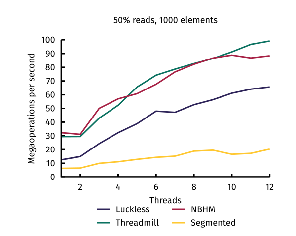

# A fast concurrent hash table.

*42nd At Threadmill* is a non-blocking hash table based on Cliff
Click's NonBlockingHashMap, and Abseil's `flat_hash_map`. We use the
general layout of the former, and the fast metadata-based probing
trick of the latter.

See [A Fast Wait-Free Hash
Table](https://www.youtube.com/watch?v=WYXgtXWejRM) and [Matt
Kulukundis's "Designing a Fast, Efficient, Cache-friendly Hash Table,
Step by Step"
presentation](https://www.youtube.com/watch?v=ncHmEUmJZf4) for an
introduction to both tables.

This library requires a pre-2.1.0 version of SBCL, an AMD64 processor,
and our [fork of the cl-simd
library](https://github.com/no-defun-allowed/cl-simd). We admittedly
only partially unbroke cl-simd; and 2.1.0 changes the assembler in
ways we don't know how to adapt to.

## Pictures of a benchmark

## Differences from Click's table

We replace copied values with a single `+copied+` marker instead of
an instance of a `Prime` class. This change generates less garbage
when copying, and leads to slightly faster barrier code.

We also removed the <key, tombstone> state, having removes transition
back to <key, empty>; a superficial change which doesn't appear to affect
anything.

## Differences from Kulukundis's table

As Click requires us to pin keys to entries, we don't ever use tombstone
metadata. The metadata for a dead entry remains in the metadata table,
as we need to be able to find the right key entry to reuse quickly.

## Previous work

This concurrent hash table is based off the
[NonBlockingHashMap](https://github.com/boundary/high-scale-lib/blob/master/src/main/java/org/cliffc/high_scale_lib/NonBlockingHashMap.java),
and its Common Lisp port in
[Luckless](https://github.com/Shinmera/luckless). It is also based off the
[linear probing hash table implementation in SICL](https://github.com/robert-strandh/SICL/tree/master/Code/Hash-tables/Linear-probing),
as well as [its SIMD fork](https://github.com/no-defun-allowed/simd-sicl-hash-table).
